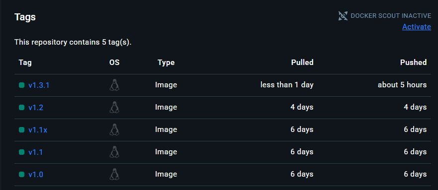

# Meltryllis con Arma!
Meltryllis inicialmente fue pensada para embendig de Link y poco a poco se le fue añadiendo funciones y con el tiempo seguira teniendo mas, pero principalmente se centra en el Embeding. <br>
 ## Embedigs que usamos:<br>
&nbsp; __Bilibili:__ &nbsp;vxbilibili.com<br>
&nbsp; __Bsky:__ &nbsp;bskyx.app<br>
&nbsp; __DeviantArt:__ &nbsp;fixdeviantart.com<br>
&nbsp; __Facebook:__ &nbsp;facebed.com<br>
&nbsp; __Furaffinity:__ &nbsp;fxfuraffinity.net<br>
&nbsp; __Imgur:__ &nbsp;imgurez.com<br>
&nbsp; __Instagram:__ &nbsp;fxinstagram.com<br>
&nbsp; __Iwara:__ &nbsp;fxiwara.seria.moe<br>
&nbsp; __Pixiv:__ &nbsp;phixiv.net<br>
&nbsp; __Reddit:__ &nbsp;rxddit.com<br>
&nbsp; __Threads:__ &nbsp;threadsez.com<br>
&nbsp; __TikTok:__ &nbsp; tiktokez.com<br>
&nbsp; __Tumblr:__ &nbsp;txtumblr.com<br>
&nbsp; __Twitch:__ &nbsp;fxtwitch.seria.moe<br>
&nbsp; __Twitter:__ &nbsp;fixvx.com<br>
&nbsp; __YouTube:__ &nbsp;youtu.be<br>
Nosotros hacemos uso del API [EMBEDEZ](https://embedez.com/) para TikTok. <br><br>
*Nosotros no tenemos ninguna injerencia o control sobre estos dominios, en caso de problemas o desacuerdo con el dominio en uso lo puedes cambiar o desactivar usando el comando **/embed***!

---

## Comandos: 
 - /hola = Info del bot y ayuda sobre los comandos.
 - /embed configurar = Desactivar & Cambiar Dominio.
 - /rolemoji 
    - help = Informacion y muetra si cuenta con los permisos necesarios para funcionar.
    - set = Establecer Emojis para reaccionar y recibir rol asociado. 
    - list = Muestra todo los "Rolemoji" hechos.
    - remove = Remover el "Rolemojis".
 - /welcome = Establece un mensaje de bienvenida, puedes usar <user> para mencionar al que se une.
 - /test 
    - Channel/Guild = Revisa por canal o todo el server, (max 24 canales), donde funciona el bot.
    - Embed = para ver las configuraciones de los embeddings. 
 - /work = Activa/Desactiva el funcionar en un canal.
 - /replybots = Activa/Desactiva el responder a otros bots, por default esta activo. 

## [Imagen en Docker Hub](https://hub.docker.com/r/nowaru124/meltryllis)



<summary>🐳 Configuracion docker-compose.yml:</summary><br>

```yaml
# docker-compose.yml
services:
  Meltry:
    image: nowaru124/meltryllis:lastest
    container_name:    
    restart: "recomendado como: on-failure:2"
    environment:
      - DISCORD_BOT_TOKEN= "Token"
      - OWNER_BOT_ID= "User ID owner"
      - LANGS_SUPPORTED= "Idiomas soportados"
      - LOCALE= "Lenguaje main" 
      - REPLY_OTHER_BOTS= "true/false"
      - DEBUG_MODE= "0 Debug/ >0 produccion"
      - STATUS_TIME_MINUTOS= "tiempo"
      - WELCOME_BANNER_URL= "banner recomendado 200x600"     
      - PUID= 
      - PGID= 
      - TZ=       
      - DB_HOST= 
      - DB_USER=
      - DB_PASSWORD=
      - DB_DATABASE=         
      - INSTAGRAM_FIX_URL=.
      - PIXIV_FIX_URL=
      - REDDIT_FIX_URL=
      - TIKTOK_FIX_URL=
      - TWITTER_FIX_URL=
      - YOUTUBE_FIX_URL=
      - BSKY_FIX_URL=
      - TWITCH_FIX_URL=
      - BILILI_FIX_URL=
      - THRENDS_FIX_URL=
      - DEVIAN_FIX_URL=
      - TUMBLR_FIX_URL=
      - FURAFF_FIX_URL=
      - IMGUR_FIX_URL=
      - IWARA_FIX_URL=
      - API_REPLACEMENT_DOMAINS= "Sitios soportados por https://embedez.com/"
      - BOT_STATUSES= "emoji | nombre | tipo de actividad"      
    volumes:
      - ./bot:/app/logs
    depends_on:
      - mariadb     
  
  mariadb:
    image: mariadb:latest
    restart: unless-stopped
    container_name:
    ports:
      - 3306:3306
    environment:
      - MYSQL_ROOT_PASSWORD=
      - MYSQL_USER=     
      - MYSQL_PASSWORD=
      - MYSQL_DATABASE=
      - PGID=
      - PUID=
    volumes:
      - ./db:/var/lib/mysql
```

---
<details>
🌳 Archivos en el Proyecto:<br><br>

```
Meltryllis con Arma/
├── src/
│   ├── client/
│   │   ├── commands/
│   │   │   ├── embed.ts
│   │   │   ├── hola.ts
│   │   │   ├── owner.ts
│   │   │   ├── replybots.ts
│   │   │   ├── rolemoji.ts
│   │   │   ├── test.ts
│   │   │   ├── welcome.ts
│   │   │   └── work.ts
│   │   ├── events/
│   │   │   ├── rolemojiEvents.ts
│   │   │   └── welcomeEvents.ts
│   │   ├── database.ts
│   │   ├── index.ts
│   │   ├── setStatus.ts
│   │   └── upCommands.ts
│   ├── i18n/
│   │   ├── index.ts
│   │   └── langCmndVal.ts 
│   ├── remplazadores/
│   │   ├── webs/
│   │   │   ├── Bilibili.ts
│   │   │   ├── Bsky.ts
│   │   │   ├── DeviantArt.ts
│   │   │   ├── Facebook.ts
│   │   │   ├── Furaffinity.ts
│   │   │   ├── Imgur.ts
│   │   │   ├── Instagram.ts
│   │   │   ├── Iwara.ts
│   │   │   ├── Pixiv.ts
│   │   │   ├── Reddit.ts
│   │   │   ├── Threads.ts
│   │   │   ├── TikTok.ts
│   │   │   ├── Tumblr.ts
│   │   │   ├── Twitch.ts
│   │   │   ├── Twitter.ts
│   │   │   └── YouTube.ts
│   │   ├── ApiReplacement.ts
│   │   ├── EmbedingConfig.ts   
│   │   ├── index.ts
│   │   └── RuleReplacement.ts
│   ├── environment.ts
│   ├── index.ts
│   └── logging.ts
├── add/
│   ├── /langs/
│   │   └── locales/
│   │       ├── es/
│   │       │   └── *.json
│   │       └── en/
│   │           └── *.json
│   └── /fonts/
│       ├── Bitcount.ttf
│       └── StoryScript-Regular.ttf/
│           └── .env
├── Dockerfile
├── package-lock.json
├── package.json
├── tsconfig.json
└── tsconfig.prod.json
   
 ```
