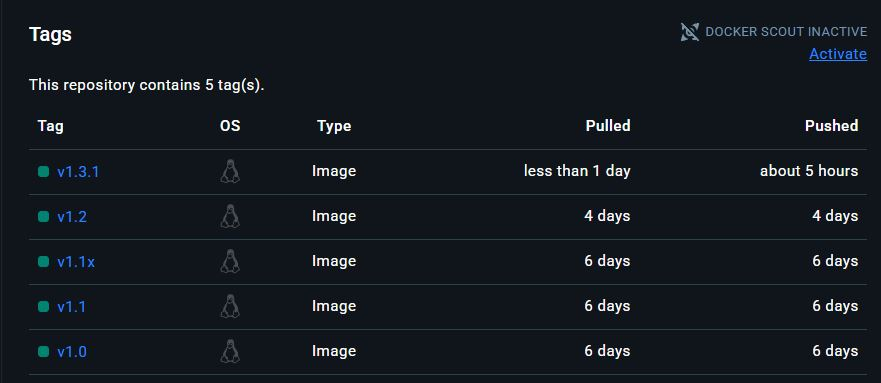

# Meltryllis con Arma!
Meltryllis inicialmente fue pensada para embedding de Link y poco a poco se le fue añadiendo funciones; con el tiempo estaremos teniendo mas funciones. <br>

<details> <summary> Dominios que usamos </summary><br>

 Estos son los sitios y dominios que usamos para el remplazo de manera local.
 |  |  |
 | ---- | ----- |
| &nbsp; __Bilibili:__ &nbsp;vxbilibili.com<br> | &nbsp; __Bsky:__ &nbsp;bskyx.app<br> |
| &nbsp; __DeviantArt:__ &nbsp;fixdeviantart.com<br> | &nbsp; __Facebook:__ &nbsp;facebed.com<br> |
| &nbsp; __Furaffinity:__ &nbsp;fxfuraffinity.net<br> | &nbsp; __Imgur:__ &nbsp;imgurez.com<br> |
| &nbsp; __Instagram:__ &nbsp;fxinstagram.com<br> | &nbsp; __Iwara:__ &nbsp;fxiwara.seria.moe<br> |
| &nbsp; __Pixiv:__ &nbsp;phixiv.net<br> | &nbsp; __Reddit:__ &nbsp;rxddit.com<br> |
| &nbsp; __Threads:__ &nbsp;threadsez.com<br> | &nbsp; __TikTok:__ &nbsp; tiktokez.com<br> |
| &nbsp; __Tumblr:__ &nbsp;txtumblr.com<br> | &nbsp; __Twitch:__ &nbsp;fxtwitch.seria.moe<br> |
| &nbsp; __Twitter:__ &nbsp;fixvx.com<br> | &nbsp; __YouTube:__ &nbsp;youtu.be<br> |

Nosotros hacemos uso del API [EMBEDEZ](https://embedez.com/) para TikTok, Imgur, Threads, danbooru, yande.re... <br><br>
Nosotros no tenemos ninguna injerencia, control o disponibilidad sobre estos dominios o el API de embedez, en caso de problemas o desacuerdo con el dominio en uso lo puedes cambiar o desactivar usando el comando ***/embed configurar***!

</details>
<details> <summary> Comandos </summary>
 
 - /hola = Info del bot y ayuda sobre los comandos.
 - /embed configurar = Desactivar & Cambiar Dominio.
 - /rolemoji: 
    - help = Informacion y muetra si cuenta con los permisos necesarios para funcionar.
    - set = Establecer Emojis para reaccionar y recibir rol asociado. 
    - list = Muestra todo los "Rolemoji" hechos.
    - remove = Remover el "Rolemojis".
 - /welcome = Establece un mensaje de bienvenida, puedes usar <user> para mencionar al que se une.
 - /test: 
    - Channel/Guild = Revisa por canal o todo el server, (max 24 canales), donde funciona el bot.
    - Embed = para ver las configuraciones de los embeddings. 
    - Chekdomainds = Pingea a los dominios de los embeds. (solo los default)
 - /work:
    - workhere = permite desactivar la funcion de embed en el canal.
    - replybot = habilita que procese link provenientes de bots en el canal.
 - /youtube:
    - help = Proporciona ayuda sobre sobre los comandos.
    - lista = Muestra todos los canales que se suiguen en el server.
    - seguir = Sigue el canal de youtube.
    - dejar = Dejas de seguir el canal de youtube.
    - test = Piblica el ultimo video del canal seleccionado. 
 - /reddit:
    - help = Proporciona ayuda sobre sobre los comandos.
    - lista = Muestra los subreddits que se suiguen en el server.
    - seguir = Seguir un Subreddit.
    - dejar = Deja de seguir un Subreddit.
    - test = Publica el ultimo pos del subreddit.
 - /cleanup:
    - start: Apartir o anteriores del mesanje.
    - menssage_id: Id del mensaje del cual see parte.
    - count: cantidad de mesnjes a borrar, Limitado a 100 porlimitaciones de discord.
    - type: Solo mesnajes de bots, solo usuarios, todos.
 - /jointovoice: 
    - set: Establece el canal maestro de voz
    - status: Muestra los canales temporales y configuraciones.
    - disable: Desactiva "/jointovoice"
    - cleanup: Borra todos los canales temporales activos. 
  - /mangadex:
    - help = Proporciona ayuda sobre sobre los comandos.
    - lista = Muestra todos los mangas que se suiguen en el server.
    - seguir = Publica las actualizaciones de un manga, se puede filtrar por idioma.
    - dejar = Dejar de seguir un manga, requiere el ID de adicion, se puede ver con /mangadex lista.
    - test = Planeado para algun futuro.
  - /permisos: |ESTE PERMISO SOLO Y UNICAMENTE PUEDE SER USADO POR ADMINISTRADORES/DUEÑO DEL SERVER|
    - set: Asigna a un usuario/rol permisos para usar comandos.
    - list: Muestra los usuarios/roles con permisos.
    - remove: Quita los permisos de un rol/usurio.
    - limpiar: Quita todos los permisos del server.
    - help: Proporciona ayuda sobre sobre los comandos.
  - Comandos de musica [ /PLAY | /STOP | /QUEUE | /SKIP ]

</details>

## 💾​ Seccion tecnica

<details> <summary> ⚙️​ Variables de configuraciones </summary>

## [](https://hub.docker.com/r/nowaru124/meltryllis/tags)



<summary>🐳 Configuracion docker-compose.yml:</summary><br>

```yaml
# docker-compose.yml
services:
  Meltry:
    image: nowaru124/meltryllis:lastest
    container_name:    
    restart: "recomendado como: on-failure:2"
    environment:
    #Cosas del Owner
      - DISCORD_BOT_TOKEN=
      - HOST_DISCORD_USER_ID=
      - REPORT_CHANNEL_ID=
    #Idiomas
      - LANGS_SUPPORTED=
      - LOCALE=
    #Configuraciones
      - DEBUG_MODE=
      - WELCOME_BANNER_URL= 
      - PUID=
      - PGID=
      - TZ=
    #Funciones "follow"
      - YOUTUBE_CHECK_TIMMER=
      - AUTO_CLEAN_YOUTUBE_TIMMER=
      - REDDIT_CHECK_TIMMER=
      - REDDIT_CLIENT_ID=
      - REDDIT_CLIENT_SECRET=
      - MANGADEX_CHECK_TIMMER=
    #Base de datos    
      - DB_HOST=
      - DB_USER=
      - DB_PASSWORD=
      - DB_DATABASE=
    #Lavalink
      - LAVALINK_ACTIVE=
      - LAVALINK_NAME=
      - LAVALINK_HOST=
      - LAVALINK_PORT=
      - LAVALINK_PASSWORD=
    #Dominios embeding         
      - INSTAGRAM_FIX_URL=
      - PIXIV_FIX_URL=
      - REDDIT_FIX_URL=
      - TIKTOK_FIX_URL=
      - TWITTER_FIX_URL=
      - YOUTUBE_FIX_URL=
      - BSKY_FIX_URL=
      - TWITCH_FIX_URL=
      - BILILI_FIX_URL=
      - THRENDS_FIX_URL=
      - DEVIAN_FIX_URL=
      - TUMBLR_FIX_URL=
      - FURAFF_FIX_URL=
      - IMGUR_FIX_URL=
      - IWARA_FIX_URL=
      - EMBEDEZ_SFW= #Los sitios que embedez soporta (SFW) https://embedez.com/api
      - EMBEDEZ_NSFW= #Los sitios que embedez soporta (NSFW) https://embedez.com/api
    #Configuraciones Bot 
      - BOT_STATUS=
      - STATUS_TIME_MINUTOS=
    volumes:
      - ./bot:/app/logs
    depends_on:
      - mariadb
      - lavalink  #En caso de usar lavalink externo borra esta linea
  
  mariadb:
    image: mariadb:latest
    restart: unless-stopped
    container_name:
    ports:
      - 3306:3306
    environment:
      - MYSQL_ROOT_PASSWORD=
      - MYSQL_USER=
      - MYSQL_PASSWORD=
      - MYSQL_DATABASE=
      - PGID=
      - PUID=
    volumes:
      - ./db:/var/lib/mysql
      
#EN CASO DE USAR UN LAVALINK EXTERNO BORRA ESTO
  lavalink:
    image: ghcr.io/lavalink-devs/lavalink:4-alpine
    container_name: lavalink-server
    ports:
      - "2333:2333"
    environment:
      - SERVER_PORT=
      - LAVALINK_SERVER_PASSWORD=
    volumes:
      - ./lavalink/application.yml:/opt/Lavalink/application.yml # es mejor setear tus configuraciones en el archivo yml.
    restart: unless-stopped
#EN CASO DE USAR UN LAVALINK EXTERNO BORRA ESTO

```

<summary>🐳 Valores para variables</summary><br>
 
| Variable Bot | Valores |
| --- | --- |
| `DISCORD_BOT_TOKEN` | TOKEN de tu bot |
| `HOST_DISCORD_USER_ID`  | Tu ID de Usuario de discord  |
| `REPORT_CHANNEL_ID` | guildId \| channelId |
| `LANGS_SUPPORTED` | Idiomas que soporta tu bot |
| `LOCALE` | Idioma por default que tendra el bot |
| `DEBUG_MODE` | "Debug mode *0* \| Produccion *>0*" |
| `YOUTUBE_CHECK_TIMMER` | Tiempo entre revisiones. Def:10m Min:5m |
| `AUTO_CLEAN_YOUTUBE_TIMMER` | Tiempo entre purgas de la BD Youtube |
| `MANGADEX_CHECK_TIMMER` | Tiempo entre revisiones. Def.&Min:20m  |
| `REDDIT_CHECK_TIMMER` | Tiempo entre revisiones. Def:10m Min:3m |
| `REDDIT_CLIENT_ID`  | [Reddit APPs Client](https://www.reddit.com/prefs/apps) |
| `REDDIT_CLIENT_SECRET`  | [Reddit APPs Token](https://www.reddit.com/prefs/apps) |
| `WELCOME_BANNER_URL` | URL para el Banner, 200x600|
| `PUID & PGID` | Usuario ID/Grupo para escribir datos |
| `TZ` | Zona Horaria "America/New_York" |
| `DB_HOST` | IP o Dominio |
| `DB_USER` | Usuario BD \| MYSQL_USER |
| `DB_PASSWORD` | Password BD \| MYSQL_PASSWORD |
| `DB_DATABASE` | Nombre BD \| MYSQL_DATABASE |
| `"Sitio"_FIX_URL` | Dominio a remplazar |
| `EMBEDEZ_NSFW/EMBEDEZ_SFW` | Sitios soportados por [Embedez](https://embedez.com/api) |
| `BOT_STATUS` | estado \| tipo de actividad |
| `STATUS_TIME_MINUTOS` | Tiempo de Rotacion de *BOT_STATUS* |
| `LAVALINK_ACTIVE` | OFF = desactiva Lavalink y sus comandos |
| `LAVALINK_NAME` | Nombre de Nodo |
| `LAVALINK_HOST` | IP / URL / name |
| `LAVALINK_PORT` | default: 2333 |
| `LAVALINK_PASSWORD` | default: youshallnotpass |

__Lavalink servers adicionales:__
LAVALINK_NAME_"<Name>" | LAVALINK_HOST_"<Name>" | LAVALINK_PORT_"<Name>" | LAVALINK_PASSWORD_"<Name>"<br>
Para añadir mas NODOS solo añade y cambia <Name> por cualquier nombre (alfanumerico) y los datos correspondientes.<br>
__**Ejemplo: LAVALINK_NAME_JP=ServerJP | LAVALINK_HOST_JP=lavalink.host | LAVALINK_PORT_JP=2333 | LAVALINK_PASSWORD_JP=youshallnotpass**__<br>

 &nbsp;**_ "YOUTUBE & REDDIT & MANGADEX CHECK_TIMMER" cuentan con timmer minimo interno para evitar bloqueos de IP _**

| Variable BD  | Valores |
| --- | --- |
| `MYSQL_ROOT_PASSWORD` | Establece contraseña Admin |
| `MYSQL_USER` | Usuario de la Base de Datos |
| `MYSQL_PASSWORD` | Contraseña de Base de datos |
| `MYSQL_DATABASE` | Nombre de Base de datos |
| `PUID & PGID` | Usuario ID/Grupo para escribir datos |

</details>


<details> <summary>🌳 Archivos en el Proyecto</summary>

```
Meltryllis con Arma/
├── /add
│   ├── /langs  
│   │   ├── /es
│   │   │   └── {ns}.json
│   │   └── /en
│   │       └── {ns}.json
│   └── /fonts
│       ├── Bitcount.ttf
│       └── StoryScript-Regular.ttf
├── /logs
│   └── {logLevel}.log
├── /src
│   ├── /Events-Commands
│   │   ├── /commandsButtons
│   │   │   └── roleButton.ts
│   │   ├── /commandsModales
│   │   │   └── reportHelp.ts
│   │   ├── /commands
│   │   │   ├── cleanup.ts
│   │   │   ├── embed.ts
│   │   │   ├── hola.ts
│   │   │   ├── jointovoice.ts
│   │   │   ├── mangadex.ts
│   │   │   ├── music.ts
│   │   │   ├── permission.st
│   │   │   ├── post.ts
│   │   │   ├── reddit.ts
│   │   │   ├── replybots.ts
│   │   │   ├── rolemoji.ts
│   │   │   ├── test.ts
│   │   │   ├── welcome.ts
│   │   │   ├── work.ts
│   │   │   └── youtube.ts
│   │   ├── /eventGear
│   │   │   ├── lavalinkConnect.ts
│   │   │   ├── mangadexCheck.ts
│   │   │   ├── redditCheck.ts
│   │   │   ├── rolemojiEvents.ts
│   │   │   ├── voiceEvents.ts
│   │   │   ├── welcomeEvents.ts
│   │   │   ├── youtubeCheck.ts
│   │   │   └── youtubeTools.ts
│   │   └── upCommands.ts
│   ├── /sys
│   │   ├── /BD-Engine
│   │   │   ├── /links
│   │   │   │   ├── Embed.ts
│   │   │   │   ├── JoinVoice.ts
│   │   │   │   ├── Mangadex.ts
│   │   │   │   ├── Permission.ts
│   │   │   │   ├── Reddit.ts
│   │   │   │   ├── Replybots.ts
│   │   │   │   ├── Rolemoji.ts
│   │   │   │   ├── Welcome.ts
│   │   │   │   └── Youtube.ts
│   │   │   └── database.ts
│   │   ├── /embedding
│   │   │   ├── /webs
│   │   │   │   ├── Bilibili.ts
│   │   │   │   ├── Bsky.ts
│   │   │   │   ├── DeviantArt.ts
│   │   │   │   ├── Facebook.ts
│   │   │   │   ├── Furaffinity.ts
│   │   │   │   ├── Imgur.ts
│   │   │   │   ├── Instagram.ts
│   │   │   │   ├── Iwara.ts
│   │   │   │   ├── Pixiv.ts
│   │   │   │   ├── Reddit.ts
│   │   │   │   ├── Threads.ts
│   │   │   │   ├── TikTok.ts
│   │   │   │   ├── Tumblr.ts
│   │   │   │   ├── Twitch.ts
│   │   │   │   ├── Twitter.ts
│   │   │   │   └── YouTube.ts
│   │   │   ├── ApiReplacement.ts
│   │   │   ├── domainChecker.ts
│   │   │   ├── EmbedingConfig.ts 
│   │   │   ├── embedService.ts
│   │   │   ├── index.ts
│   │   │   └── RuleReplacement.ts
│   │   ├── /i18n
│   │   │   ├── index.ts
│   │   │   └── nsKeyCheck.ts
│   │   ├── /zGears
│   │   │   ├── auxiliares.ts
│   │   │   ├── formularios.ts
│   │   │   ├── mPermisions.ts
│   │   │   ├── neTools.ts
│   │   │   ├── owner.ts
│   │   │   ├── RedditApi.ts
│   │   │   └── setStatus.ts
│   │   ├── core.ts
│   │   ├── environment.ts
│   │   └── logging.ts
│   └── index.ts
├── .env
├── Dockerfile
├── package-lock.json
├── package.json
├── tsconfig.json
└── tsconfig.prod.json
   
 ```
</details>
