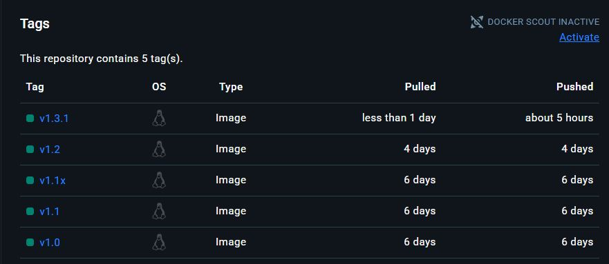

# Meltryllis con Arma!
Meltryllis inicialmente fue pensada para embedding de Link y poco a poco se le fue añadiendo funciones; con el tiempo estaremos teniendo mas funciones. <br>

<details> <summary> Dominios que usamos </summary><br>

 Puedes usar && para avitar el procesamiento del mesanje, tambien se ignoraran los mensaje de embedez + link. (ej. https://embedez.com/download?q=https://x.com/i/status/...)
 Si deceas que se procesen mensaje de bots puedes usar el comando /work. 
 Estos son los sitios y dominios que usamos para el remplazo de manera local.
 |  |  |
 | ---- | ----- |
| &nbsp; __Bilibili:__ &nbsp;vxbilibili.com<br> | &nbsp; __Bsky:__ &nbsp;bskyx.app<br> |
| &nbsp; __DeviantArt:__ &nbsp;fixdeviantart.com<br> | &nbsp; __Facebook:__ &nbsp;facebed.com<br> |
| &nbsp; __Furaffinity:__ &nbsp;fxfuraffinity.net<br> | &nbsp; __Imgur:__ &nbsp;imgurez.com<br> |
| &nbsp; __Instagram:__ &nbsp;fxinstagram.com<br> | &nbsp; __Iwara:__ &nbsp;fxiwara.seria.moe<br> |
| &nbsp; __Pixiv:__ &nbsp;phixiv.net<br> | &nbsp; __Reddit:__ &nbsp;rxddit.com<br> |
| &nbsp; __Threads:__ &nbsp;threadsez.com<br> | &nbsp; __TikTok:__ &nbsp; tiktokez.com<br> |
| &nbsp; __Tumblr:__ &nbsp;txtumblr.com<br> | &nbsp; __Twitch:__ &nbsp;fxtwitch.seria.moe<br> |
| &nbsp; __Twitter:__ &nbsp;fixvx.com<br> | &nbsp; __YouTube:__ &nbsp;youtu.be<br> |

Nosotros hacemos uso del API [EMBEDEZ](https://embedez.com/) para TikTok, Imgur, Threads, danbooru, yande.re... se separan como NSFW y SFW como ellos los catalogan<br><br>
Nosotros no tenemos ninguna injerencia, control o disponibilidad sobre estos dominios o el API de embedez, en caso de problemas o desacuerdo con el dominio en uso lo puedes cambiar o desactivar usando el comando ***/embed configurar***!

</details>
<details> <summary> Comandos </summary>

 Varios comandos como "/embed configurar", opciones de /help, usan Autocompletado debido al limite de 25 items, solo escribie lo que buscas hasta que aparesca. 

- /help:
  - Report: Permite mandar mansajes al desarrollador.
  - Command: Muetras la informacion del comando seleccionmado, si puedes ejecutarlo y si cuanta con permisos en el canal para hacaerlo.
- /embed configurar = Desactivar & Cambiar Dominio.
- /rolemoji: 
  - set: Establecer Emojis para reaccionar y recibir rol asociado. 
  - list: Muestra todo los "Rolemoji" hechos.
  - remove: Remover el "Rolemojis".
- /welcome: Establece un mensaje de bienvenida, puedes usar <user> para mencionar al que se une.
- /test: 
  - Channel/Guild: Revisa por canal o todo el server, (max 24 canales), donde funciona el bot.
  - Embed: para ver las configuraciones de los embeddings. 
  - Chekdomainds: Pingea a los dominios de los embeds. (solo los default)
- /work:  
  - workhere: permite desactivar la funcion de embed en el canal.
  - replybot: habilita que procese link provenientes de bots en el canal.
- /youtube:
  - lista: Muestra todos los canales que se suiguen en el server.
  - seguir: Sigue el canal de youtube.
  - dejar: Dejas de seguir el canal de youtube.
  - test: Piblica el ultimo video del canal seleccionado. 
- /reddit:
  - lista: Muestra los subreddits que se suiguen en el server.
  - seguir: Seguir un Subreddit.
  - dejar: Deja de seguir un Subreddit.
  - test: Publica el ultimo pos del subreddit.
- /cleanup:
  - start: Apartir o anteriores del mesanje.
  - menssage_id: Id del mensaje del cual see parte.
  - count: cantidad de mesnjes a borrar, Limitado a 100 porlimitaciones de discord.
  - type: Solo mesnajes de bots, solo usuarios, todos.
- /cronpost
  - crear: Programa un post automatico, Pueden ser fechas exactas o todos/un dia de la semana.
  - lista: Muestra todos los post automaticos acctivos.
  - showpost: Muestra la previa del post automatico.
  - borrar: Borrar el progrma ade un post automatico.
- /jointovoice: 
  - set: Establece el canal maestro de voz
  - status: Muestra los canales temporales y configuraciones.
  - disable: Desactiva "/jointovoice"
  - cleanup: Borra todos los canales temporales activos. 
- /mangadex:
  - lista = Muestra todos los mangas que se suiguen en el server.
  - seguir = Publica las actualizaciones de un manga, se puede filtrar por idioma.
  - dejar = Dejar de seguir un manga, requiere el ID de adicion, se puede ver con /mangadex lista.
  - test = Planeado para algun futuro.
- /permisos: |ESTE PERMISO SOLO Y UNICAMENTE PUEDE SER USADO POR ADMINISTRADORES/DUEÑO DEL SERVER|
  - set: Asigna a un usuario/rol permisos para usar comandos.
  - list: Muestra los usuarios/roles con permisos.
  - remove: Quita los permisos de un rol/usurio.
  - limpiar: Quita todos los permisos del server.
- /server: Permite revisar los permisos que pose un Usuario y los que otorga un Rol.
  - Rol:
    - Permite ver que roles estan debajo de otros segun el permiso. 
  - Bits:
    - on: Muestras los permisos que tiene el usuario o Rol en un canal espesifico. 
    - off: Muestra los permisos por default que tiene el usuario o Rol en general, difieren en canales con permisos personalizados.
- /buttonlink
  - Permite crear botones con links. Mx. 5 por post
- /buttonrole
  - Permite crear botones que asignan un Rol. Mx. 5 botones por post. 
  - Se puede crear un mensaje personalizado al asignar el rol. 
- Comandos de musica [ /PLAY | /STOP | /QUEUE | /SKIP ]
- /noeveryone: 
  - Borra automaticamente automaticamente las menciones @everyone|@here.
  - Permite añadir un rol el cual puede usarlos sin restriccion
  - Puede auto penalizar usuarios que spamen las menciones @everyone|@here; restringe el chat, desde una hora hasta doce horas!
- /post
  - msg: envia un mensaje a un canal atravez del bot.
  - copy: copia un mensaje existente y publicalo atravez del bot.
  - reply; permite constestar mensajes.
  - edit: permite editar cualquier mensaje publicado por el bot.


</details>

# Política de Privacidad
<details> <summary> Leer; el no leerlo no te exime de responsabilidad! </summary>
 <br>
 Meltryllis con Arma! es un bot multifuncional para Discord, diseñado principalmente para mejorar el Embedding sustituyendo dominios de URLs/Links, generar mensajes de bienvenida/despedida, y crear sistemas de autoroles mediante reacciones. La privacidad de los usuarios y servidores es nuestra prioridad.

¿Qué datos recopilamos? El bot no guarda el contenido de los mensajes. Únicamente almacenamos identificadores (IDs) proporcionados por la API de Discord estrictamente necesarios para su funcionamiento:

ID del Servidor (Guild) y Canal: Para saber dónde aplicar las configuraciones.

ID de Usuario: Exclusivamente al usar comandos de configuración (como /embed), con el fin de mantener un registro interno de qué administrador realizó modificaciones en el sistema de redireccionamiento.

Uso y visibilidad de los datos:
Las configuraciones almacenadas son únicas y privadas para cada servidor; no pueden ser vistas, compartidas ni modificadas desde otros servidores. Las IDs de usuario guardadas solo son relevantes a nivel interno para la auditoría de los administradores del servidor.

Retención y Eliminación de datos (Derecho al olvido):

Sistema de Purga Automática: Si el bot es expulsado del servidor, se activará nuestro sistema de purga automático (IO-Server), el cual realiza un borrado absoluto ("Hard Delete") de todas las configuraciones, IDs y datos relacionados con ese gremio de nuestra base de datos.

Borrado Manual: Los administradores pueden restaurar las configuraciones a su estado inicial utilizando el subcomando /embed default, lo cual eliminará permanentemente la ID de Usuario asociada a dicha configuración.

Seguridad de Acceso:
Para evitar abusos, los comandos de configuración de Meltryllis están estrictamente limitados. Solo el propietario del servidor (Owner), administradores, o usuarios con permisos explícitamente delegados mediante el comando /permisos pueden interactuar con estas funciones.
</details>

# Términos de Servicio
<details> <summary> Leer; el no leerlo no te exime de responsabilidad! </summary>
<br>
Estos Términos de Servicio rigen el uso de nuestro bot, "Meltryllis con Arma!", proporcionado a través de la plataforma Discord. Al invitar, mantener o interactuar con el bot en su servidor, usted acepta cumplir y estar sujeto a los siguientes términos.

1. Acuerdos y Cumplimiento:<br>
El uso de Meltryllis implica la aceptación total de las políticas base de la plataforma:
- [Terminos de Discord](https://discord.com/terms)  // [Lineamintos de Comunidad](https://discord.com/guidelines)

2. Responsabilidad de Uso:<br>
El uso de funciones como la reasignación de dominios para URLs/Links (mediante el comando /embed) es responsabilidad exclusiva del Propietario del Servidor y sus Administradores.
Los usuarios son responsables de garantizar que el contenido compartido e interactuado a través del bot no infrinja las leyes locales, nacionales o internacionales, ni los lineamientos de Discord.

3. Garantías y Disponibilidad:<br>
Meltryllis con Arma! se proporciona "tal cual" (as-is). No ofrecemos garantías implícitas ni explícitas sobre la disponibilidad ininterrumpida, el funcionamiento perfecto libre de errores, o la periodicidad de las actualizaciones.

4. Limitación de Responsabilidad:<br>
No nos hacemos responsables por daños directos, indirectos, incidentales o consecuentes que resulten del uso, incapacidad de uso o fallos del bot.

No nos responsabilizamos por el mal uso que los usuarios de un servidor puedan darle a las herramientas proporcionadas por el bot.
Toda información de configuración guardada puede estar sujeta a pérdida o corrupción de datos por factores externos; es responsabilidad de los administradores gestionar sus configuraciones.

5. Terminación del Servicio:<br>
Nos reservamos el derecho de bloquear el acceso al bot, denegar el servicio, o abandonar/eliminar el bot de cualquier servidor en cualquier momento, por cualquier motivo y sin previo aviso (especialmente en casos de abuso o incumplimiento de los términos de Discord).
</details>

## 💾​ Seccion tecnica

<details> <summary> ⚙️​ Variables de configuraciones </summary>

## [](https://hub.docker.com/r/nowaru124/meltryllis/tags)



<summary>🐳 Configuracion docker-compose.yml:</summary><br>

```yaml
# docker-compose.yml
services:
  Meltry:
    image: nowaru124/meltryllis:lastest
    container_name: botmeltrys
    restart: "recomendado como: on-failure:2"
    environment:
    #Cosas del Owner
      DISCORD_BOT_TOKEN: "Discord Token" #Developer portal > APP > Bot  https://discord.com/developers/applications
      HOST_DISCORD_USER_ID: "Tu ID de Usuario de discord" #Marca a quien reconoce como dueño para ciertos comandos.
      REPORT_CHANNEL_ID: "guildId|channelId" #Aqui llegarn los reportes.
    #Idiomas
      LANGS_SUPPORTED: "es" #idiomas que soporta el bot "es, en, pt"
      LOCALE: "es" #Idioma que tendra los comandos por defualt
    #Configuraciones
      DEBUG_MODE: "" #por defaul es produccion, para modo debug usa, "on", "true" o "1"
      WELCOME_BANNER_URL: "https://host.com/img.jpg" #URL para el Banner. Relacion 1:3 recomendada 
      PUID: 1000 #Usuario ID/Grupo para escribir datos
      PGID: 1000 #Grupo ID/Grupo para escribir datos
      TZ: "America/New_York" #Zona Horaria importante para /cronpost y el log
    #Funciones "follow"
      MANGADEX_CHECK_TIMMER: 20 #Tiempo entre revisiones. Def.&Min:20m
      YOUTUBE_CHECK_TIMMER: 30 #Tiempo entre revisiones. Def:10m Min:5m
      REDDIT_CHECK_TIMMER: 10 #Tiempo entre revisiones. Def:10m Min:3m
      REDDIT_CLIENT_ID: "tu Token de app de reddit" #[Reddit APPs Client](https://www.reddit.com/prefs/apps)
      REDDIT_CLIENT_SECRET: "tu Token de app de reddit" #[Reddit APPs Token](https://www.reddit.com/prefs/apps)
    #Base de datos    
      DB_HOST: "127.0.0.1" #IP/Dominio/Docker name
      DB_USER: "MYSQL_USER" 
      DB_PASSWORD: "MYSQL_PASSWORD"
      DB_DATABASE: "MYSQL_DATABASE"
    #Lavalink si falta uno se considera desactivado el comando
      LAVALINK_NAME: "mylavalink" #Nombre con el que se identifica
      LAVALINK_HOST: "127.0.0.1" #IP/Dominio/Docker name
      LAVALINK_PORT: "2333" #Puerto default no seguro
      LAVALINK_PASSWORD: "youshallnotpass" # contraseña si no es la default
    #Ahora los dominios se gestionan desde la BD con el comando de dueño
      BOT_STATUS: "Playing|Guns and Nuns: Storming Hell;Listening|kyOresu - MAGICAL DOOMER" #Tipos de activodad "Playing", "Watching", "Listening", "Streaming", "Competing"
      STATUS_TIME_MINUTOS: 60 #Tiempo de Rotacion de BOT_STATUS
    volumes:
      - ./bot:/app/logs
    depends_on:
      - mariadb
      - lavalink  #En caso de usar lavalink externo borra esta linea
  
  mariadb:
    image: mariadb:latest
    restart: unless-stopped
    container_name:
    ports:
      - 3306:3306
    environment:
      MYSQL_ROOT_PASSWORD: "MYSQL_ROOT_PASSWORD" #recuerda poner una contraseña segura
      MYSQL_USER: "MYSQL_USER" 
      MYSQL_PASSWORD: "MYSQL_PASSWORD" #recuerda poner una contraseña segura
      MYSQL_DATABASE: "MYSQL_DATABASE"
      PGID: 1000 #Grupo ID/Grupo para escribir datos
      PUID: 1000 #Usuario ID/Grupo para escribir datos
    volumes:
      - ./db:/var/lib/mysql
      
#EN CASO DE USAR UN LAVALINK EXTERNO BORRA ESTO
  lavalink:
    image: ghcr.io/lavalink-devs/lavalink:4-alpine
    container_name: lavalink-server
    ports:
      - 2333:2333
    environment:
      SERVER_PORT: "2333"
      LAVALINK_SERVER_PASSWORD: "youshallnotpass"
    volumes:
      - ./lavalink/application.yml:/opt/Lavalink/application.yml # es mejor setear tus configuraciones en el archivo yml.
    restart: unless-stopped
#EN CASO DE USAR UN LAVALINK EXTERNO BORRA ESTO

```
</details>


<details> <summary>🌳 Archivos en el Proyecto</summary>

```
📦
├── 📁 Pict/
│   ├── 🖼️ Banner.webp
│   ├── 🖼️ DockerHub.JPG
│   ├── 🖼️ RolemojiHelp.png
│   ├── 🖼️ banner-v1.jpg
│   ├── 🖼️ banner-v2.jpg
│   └── 🖼️ embedd.gif
├── 📁 adds/
│   ├── 📁 fonts/
│   │   ├── 📄 Agbalumo.ttf
│   │   ├── 📄 Bangers.ttf
│   │   ├── 📄 Bitcount.ttf
│   │   ├── 📄 BungeeShade.ttf
│   │   ├── 📄 Chewy.ttf
│   │   ├── 📄 ConcertOne.ttf
│   │   ├── 📄 Creepster.ttf
│   │   ├── 📄 FjallaOne.ttf
│   │   ├── 📄 FrederickatheGreat.ttf
│   │   ├── 📄 LuckiestGuy.ttf
│   │   ├── 📄 MarckScript.ttf
│   │   ├── 📄 Metamorphous.ttf
│   │   ├── 📄 MiltonianTattoo.ttf
│   │   ├── 📄 Monoton.ttf
│   │   ├── 📄 NerkoOne.ttf
│   │   ├── 📄 Orbitron.ttf
│   │   ├── 📄 PermanentMarker.ttf
│   │   ├── 📄 PlaywriteGBSGuides.ttf
│   │   ├── 📄 PressStart2P.ttf
│   │   ├── 📄 SingleDay.ttf
│   │   ├── 📄 StoryScript.ttf
│   │   ├── 📄 WalterTurncoat.ttf
│   │   └── 📄 ZenDots.ttf
│   └── 📁 langs/
│       ├── 📁 es/
│       │   ├── ⚙️ botones.json
│       │   ├── ⚙️ commands.json
│       │   ├── ⚙️ common.json
│       │   └── ⚙️ help.json
│       └── 📁 missing/
├── 📁 src/
│   ├── 📁 bgProcess/
│   │   ├── 📄 exeCron.ts
│   │   ├── 📄 lavalinkConnect.ts
│   │   ├── 📄 mangadexChek.ts
│   │   ├── 📄 noEvery.ts
│   │   ├── 📄 redditCheck.ts
│   │   ├── 📄 rolemojiEvents.ts
│   │   ├── 📄 voicEvent.ts
│   │   ├── 📄 welcomeEvents.ts
│   │   └── 📄 youtubeCheck.ts
│   ├── 📁 commands/
│   │   ├── 📁 commandButtons/
│   │   │   ├── 📄 NewLimits.ts
│   │   │   ├── 📄 buttonLink.ts
│   │   │   └── 📄 roleButton.ts
│   │   ├── 📁 commandModales/
│   │   │   ├── 📄 modalLimits.ts
│   │   │   └── 📄 reportHelp.ts
│   │   ├── 📁 commands/
│   │   │   ├── 📄 chkperm.ts
│   │   │   ├── 📄 cleanup.ts
│   │   │   ├── 📄 cronpost.ts
│   │   │   ├── 📄 embed.ts
│   │   │   ├── 📄 help.ts
│   │   │   ├── 📄 jointovoice.ts
│   │   │   ├── 📄 mangadex.ts
│   │   │   ├── 📄 music.ts
│   │   │   ├── 📄 permission.ts
│   │   │   ├── 📄 post.ts
│   │   │   ├── 📄 reddit.ts
│   │   │   ├── 📄 rolemoji.ts
│   │   │   ├── 📄 test.ts
│   │   │   ├── 📄 welcome.ts
│   │   │   ├── 📄 work.ts
│   │   │   └── 📄 youtube.ts
│   │   └── 📄 upCommands.ts
│   ├── 📁 sys/
│   │   ├── 📁 DB-Engine/
│   │   │   ├── 📁 links/
│   │   │   │   ├── 📄 Cronpost.ts
│   │   │   │   ├── 📄 Embed.ts
│   │   │   │   ├── 📄 JointoVoice.ts
│   │   │   │   ├── 📄 Mangadex.ts
│   │   │   │   ├── 📄 Permission.ts
│   │   │   │   ├── 📄 Reddit.ts
│   │   │   │   ├── 📄 ReplyBots.ts
│   │   │   │   ├── 📄 Rolemoji.ts
│   │   │   │   ├── 📄 Welcome.ts
│   │   │   │   ├── 📄 Youtube.ts
│   │   │   │   ├── 📄 noRules.ts
│   │   │   │   └── 📄 roleButtons.ts
│   │   │   └── 📄 database.ts
│   │   ├── 📁 embedding/
│   │   │   ├── 📁 webs/
│   │   │   │   ├── 📄 Bilibili.ts
│   │   │   │   ├── 📄 Bsky.ts
│   │   │   │   ├── 📄 DeviantArt.ts
│   │   │   │   ├── 📄 Facebook.ts
│   │   │   │   ├── 📄 Furaffinity.ts
│   │   │   │   ├── 📄 Imgur.ts
│   │   │   │   ├── 📄 Instagram.ts
│   │   │   │   ├── 📄 Iwara.ts
│   │   │   │   ├── 📄 Pixiv.ts
│   │   │   │   ├── 📄 Reddit.ts
│   │   │   │   ├── 📄 Threads.ts
│   │   │   │   ├── 📄 TikTok.ts
│   │   │   │   ├── 📄 Tumblr.ts
│   │   │   │   ├── 📄 Twitch.ts
│   │   │   │   ├── 📄 Twitter.ts
│   │   │   │   └── 📄 YouTube.ts
│   │   │   ├── 📄 RuleReplacement.ts
│   │   │   ├── 📄 domainChecker.ts
│   │   │   ├── 📄 embedService.ts
│   │   │   ├── 📄 embedingConfig.ts
│   │   │   ├── 📄 embedingSwitch.ts
│   │   │   └── 📄 index.ts
│   │   ├── 📁 i18n/
│   │   │   ├── 📄 index.ts
│   │   │   └── 📄 nsKeyCheck.ts
│   │   ├── 📁 zGears/
│   │   │   ├── 📄 IO-Server.ts
│   │   │   ├── 📄 RedditApi.ts
│   │   │   ├── 📄 auxiliares.ts
│   │   │   ├── 📄 mPermission.ts
│   │   │   ├── 📄 neTools.ts
│   │   │   ├── 📄 owner.ts
│   │   │   └── 📄 setStatus.ts
│   │   ├── 📄 core.ts
│   │   ├── 📄 environment.ts
│   │   └── 📄 logging.ts
│   └── 📄 index.ts
├── ⚙️ .env ejemplo
├── ⚙️ .gitignore
├── 🐳 Dockerfile
├── 📄 LICENSE.txt
├── 📝 README.md
├── 📝 Terminos de Privacidad de Meltryllis con Arma!.md
├── 📝 Terminos de servicio de Meltryllis con Arma!.md
├── ⚙️ application.yml
├── ⚙️ docker-compose.yml
└── 📄 domains.sql

 ```
</details>


