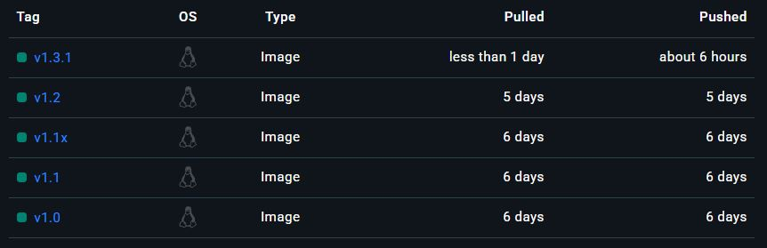

# Meltryllis con Arma!
Meltryllis inicialmente fue pensada para embedding de Link y poco a poco se le fue añadiendo funciones; con el tiempo estaremos teniendo mas funciones. <br>
 ## Dominios que usamos en los Embedigs:<br>
 |  |  |
 | ---- | ----- |
| &nbsp; __Bilibili:__ &nbsp;vxbilibili.com<br> | &nbsp; __Bsky:__ &nbsp;bskyx.app<br> |
| &nbsp; __DeviantArt:__ &nbsp;fixdeviantart.com<br> | &nbsp; __Facebook:__ &nbsp;facebed.com<br> |
| &nbsp; __Furaffinity:__ &nbsp;fxfuraffinity.net<br> | &nbsp; __Imgur:__ &nbsp;imgurez.com<br> |
| &nbsp; __Instagram:__ &nbsp;fxinstagram.com<br> | &nbsp; __Iwara:__ &nbsp;fxiwara.seria.moe<br> |
| &nbsp; __Pixiv:__ &nbsp;phixiv.net<br> | &nbsp; __Reddit:__ &nbsp;rxddit.com<br> |
| &nbsp; __Threads:__ &nbsp;threadsez.com<br> | &nbsp; __TikTok:__ &nbsp; tiktokez.com<br> |
| &nbsp; __Tumblr:__ &nbsp;txtumblr.com<br> | &nbsp; __Twitch:__ &nbsp;fxtwitch.seria.moe<br> |
| &nbsp; __Twitter:__ &nbsp;fixvx.com<br> | &nbsp; __YouTube:__ &nbsp;youtu.be<br> |

Nosotros hacemos uso del API [EMBEDEZ](https://embedez.com/) para TikTok, Imgur & Threads. <br>
__*Nosotros no tenemos ninguna injerencia o control sobre estos dominios, en caso de problemas o desacuerdo con el dominio en uso lo puedes cambiar o desactivar usando el comando **/embed***!__

---

## Comandos: 
 - /hola = Info del bot y ayuda sobre los comandos.
 - /embed configurar = Desactivar & Cambiar Dominio.
 - /rolemoji: 
    - help = Informacion y muetra si cuenta con los permisos necesarios para funcionar.
    - set = Establecer Emojis para reaccionar y recibir rol asociado. 
    - list = Muestra todo los "Rolemoji" hechos.
    - remove = Remover el "Rolemojis".
 - /welcome = Establece un mensaje de bienvenida, puedes usar <user> para mencionar al que se une.
 - /test: 
    - Channel/Guild = Revisa por canal o todo el server, (max 24 canales), donde funciona el bot.
    - Embed = para ver las configuraciones de los embeddings. 
 - /work = Activa/Desactiva el funcionar en un canal.
 - /replybots = Activa/Desactiva el responder a otros bots, por default esta activo.
 - /youtube:
    - help = Proporciona ayuda sobre sobre los comandos.
    - lista = Muestra todos los canales que se suiguen en el server.
    - seguir = Sigue el canal de youtube.
    - dejar = Dejas de seguir el canal de youtube.
    - test = Piblica el ultimo video del canal seleccionado. 
 - /reddit:
    - help = Proporciona ayuda sobre sobre los comandos.
    - lista = Muestra los subreddits que se suiguen en el server.
    - seguir = Seguir un Subreddit.
    - dejar = Deja de seguir un Subreddit.
    - test = Publica el ultimo pos del subreddit.
 
---    

## [Imagen en Docker Hub](https://hub.docker.com/r/nowaru124/meltryllis)



<summary>🐳 Configuracion docker-compose.yml:</summary><br>

```yaml
# docker-compose.yml
services:
  Meltry:
    image: nowaru124/meltryllis:lastest
    container_name:    
    restart: "recomendado como: on-failure:2"
    environment:
      #Cosas del Owner
      - DISCORD_BOT_TOKEN=
      - OWNER_BOT_ID=
      #Idiomas
      - LANGS_SUPPORTED=
      - LOCALE=
      #Configuraciones
      - DEBUG_MODE=
      - YOUTUBE_CHECK_TIMMER=
      - AUTO_CLEAN_YOUTUBE_TIMMER=
      - REDDIT_CHECK_TIMMER=
      - REPLY_OTHER_BOTS=
      - WELCOME_BANNER_URL= 
      - PUID=
      - PGID=
      - TZ=
      #Base de datos    
      - DB_HOST=
      - DB_USER=
      - DB_PASSWORD=
      - DB_DATABASE=
      #Dominios remplazadores         
      - INSTAGRAM_FIX_URL=
      - PIXIV_FIX_URL=
      - REDDIT_FIX_URL=
      - TIKTOK_FIX_URL=
      - TWITTER_FIX_URL=
      - YOUTUBE_FIX_URL=
      - BSKY_FIX_URL=
      - TWITCH_FIX_URL=
      - BILILI_FIX_URL=
      - THRENDS_FIX_URL=
      - DEVIAN_FIX_URL=
      - TUMBLR_FIX_URL=
      - FURAFF_FIX_URL=
      - IMGUR_FIX_URL=
      - IWARA_FIX_URL=
      - API_REPLACEMENT_DOMAINS=
      #Configuraciones Bot 
      - BOT_STATUSES=
      - STATUS_TIME_MINUTOS=
    volumes:
      - ./bot:/app/logs
    depends_on:
      - mariadb     
  
  mariadb:
    image: mariadb:latest
    restart: unless-stopped
    container_name:
    ports:
      - 3306:3306
    environment:
      - MYSQL_ROOT_PASSWORD=
      - MYSQL_USER=
      - MYSQL_PASSWORD=
      - MYSQL_DATABASE=
      - PGID=
      - PUID=
    volumes:
      - ./db:/var/lib/mysql
```
<details> <summary>🐳 Valores para variables</summary>
 
| Variable Bot | Valores |
| --- | --- |
| `DISCORD_BOT_TOKEN` | TOKEN de tu bot |
| `OWNER_BOT_ID`  | Tu ID de Usuario de discord  |
| `LANGS_SUPPORTED` | Idiomas que soporta tu bot |
| `LOCALE` | Idioma por default que tendra el bot |
| `REPLY_OTHER_BOTS` | "true \| false" Responder a Bots |
| `DEBUG_MODE` | "Debug mode *0* \| Produccion *>0*" |
| `YOUTUBE_CHECK_TIMMER` | Tiempo entre revisiones. Def:10m Min:5m |
| `AUTO_CLEAN_YOUTUBE_TIMMER` | Tiempo entre purgas de la BD Youtube |
| `REDDIT_CHECK_TIMMER` | Tiempo entre revisiones. Def:10m Min:3m |
| `WELCOME_BANNER_URL` | URL para el Banner, 200x600|
| `PUID & PGID` | Usuario ID/Grupo para escribir datos |
| `TZ` | Zona Horaria "America/New_York" |
| `DB_HOST` | IP o Dominio |
| `DB_USER` | Usuario BD \| MYSQL_USER |
| `DB_PASSWORD` | Password BD \| MYSQL_PASSWORD |
| `DB_DATABASE` | Nombre BD \| MYSQL_DATABASE |
| `"Sitio"_FIX_URL` | Dominio a remplazar |
| `API_REPLACEMENT_DOMAINS` | Sitios soportados por [Embedez](https://embedez.com/) |
| `BOT_STATUSES` | emoji \| nombre \| tipo de actividad |
| `STATUS_TIME_MINUTOS` | Tiempo de Rotacion de *BOT_STATUSES* |
##### **_ "YOUTUBE & REDDIT CHECK_TIMMER" cuentan con timmer minimo interno para evitar bloqueos de IP _**

| Variable BD  | Valores |
| --- | --- |
| `MYSQL_ROOT_PASSWORD` | Establece contraseña Admin |
| `MYSQL_USER` | Usuario de la Base de Datos |
| `MYSQL_PASSWORD` | Contraseña de Base de datos |
| `MYSQL_DATABASE` | Nombre de Base de datos |
| `PUID & PGID` | Usuario ID/Grupo para escribir datos |

</details>


<details> <summary>🌳 Archivos en el Proyecto</summary>

```
Meltryllis con Arma/
├── src/
│   ├── client/
│   │   ├── commands/
│   │   │   ├── embed.ts
│   │   │   ├── hola.ts
│   │   │   ├── owner.ts
|   |   |   ├── reddit.ts
│   │   │   ├── replybots.ts
│   │   │   ├── rolemoji.ts
│   │   │   ├── test.ts
│   │   │   ├── welcome.ts
│   │   │   ├── work.ts
│   │   │   └── youtube.ts
│   │   ├── coreCommands/
│   │   │   ├── redditCheck.ts
│   │   │   ├── rolemojiEvents.ts
│   │   │   ├── upCommands.ts
│   │   |   ├── welcomeEvents.ts
|   |   |   ├── youtubeCheck.ts
|   |   |   └── yTools.ts
|   |   └── index.ts
│   ├── i18n/
│   │   ├── index.ts
│   │   └── langCmndVal.ts
│   ├── remplazadores/
│   │   ├── webs/
│   │   │   ├── Bilibili.ts
│   │   │   ├── Bsky.ts
│   │   │   ├── DeviantArt.ts
│   │   │   ├── Facebook.ts
│   │   │   ├── Furaffinity.ts
│   │   │   ├── Imgur.ts
│   │   │   ├── Instagram.ts
│   │   │   ├── Iwara.ts
│   │   │   ├── Pixiv.ts
│   │   │   ├── Reddit.ts
│   │   │   ├── Threads.ts
│   │   │   ├── TikTok.ts
│   │   │   ├── Tumblr.ts
│   │   │   ├── Twitch.ts
│   │   │   ├── Twitter.ts
│   │   │   └── YouTube.ts
│   │   ├── ApiReplacement.ts
│   │   ├── EmbedingConfig.ts   
│   │   ├── index.ts
│   │   └── RuleReplacement.ts
│   ├── sys/
│   │   ├── database.ts
│   │   ├── setStatus.ts
│   │   ├── environment.ts
|   |   └── logging.ts
│   └── index.ts
├── add/
│   ├── /langs/
│   │   └── locales/
│   │       ├── es/
│   │       │   └── *.json
│   │       └── en/
│   │           └── *.json
│   └── /fonts/
│       ├── Bitcount.ttf
│       └── StoryScript-Regular.ttf/
├── .env
├── Dockerfile
├── package-lock.json
├── package.json
├── tsconfig.json
└── tsconfig.prod.json
   
 ```
</details>
